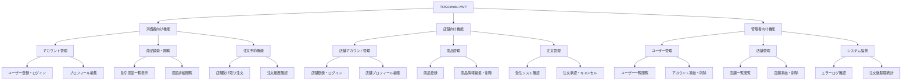
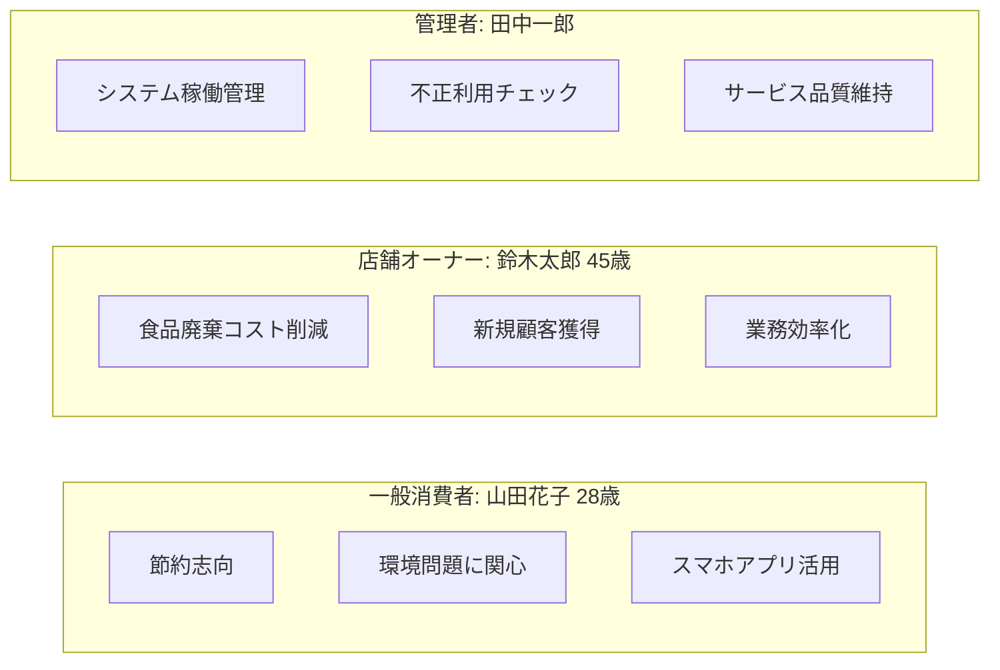
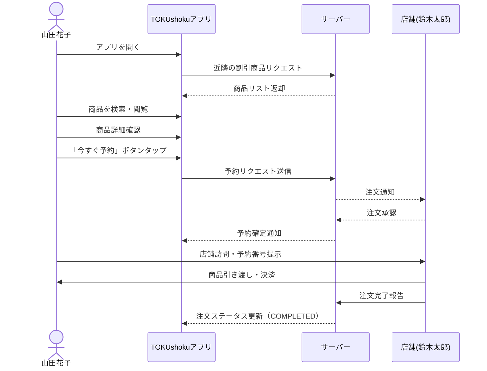
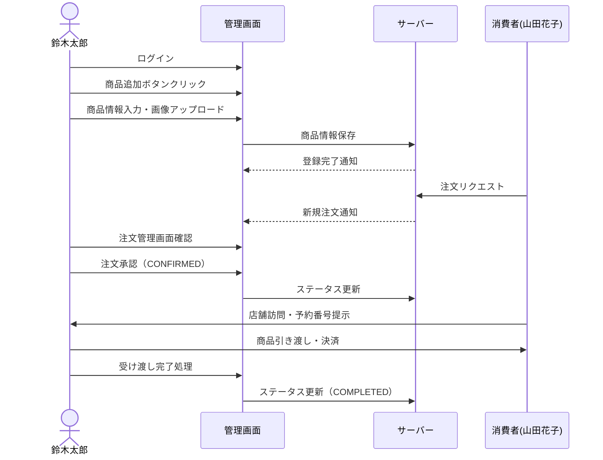
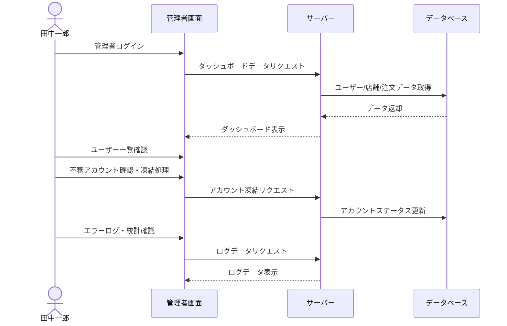
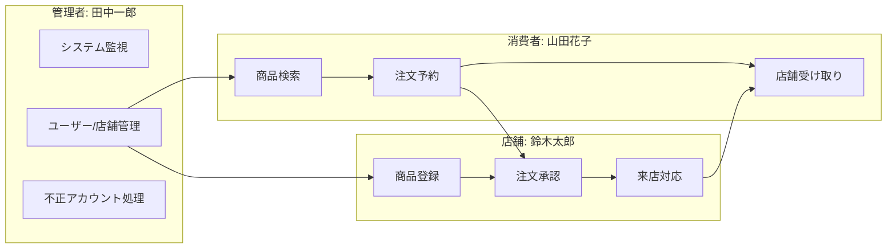
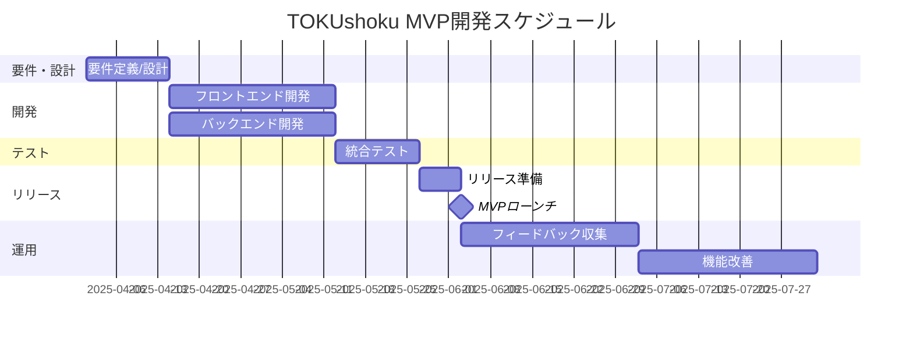
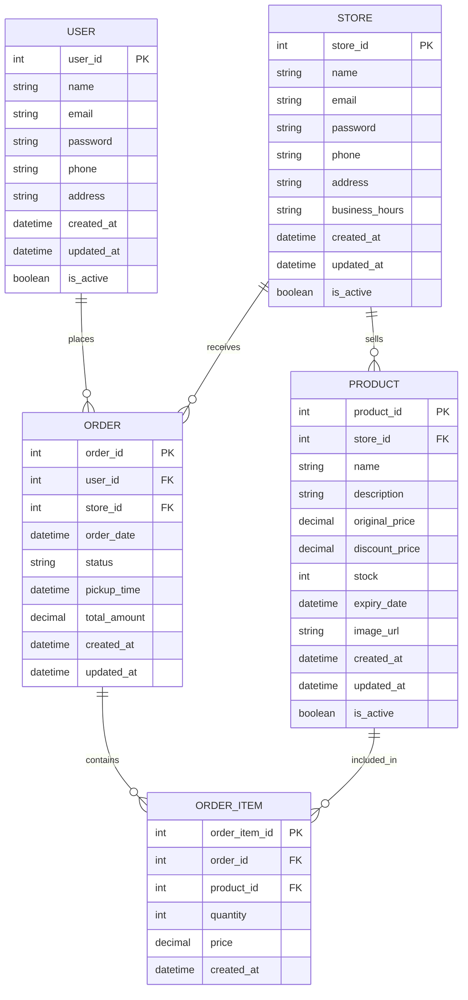

# TOKUshoku MVP 詳細設計資料

## 📋 プロジェクト概要

**TOKUshoku**は、余剰食品を割引販売することで食品ロス削減と店舗・消費者双方のメリットを創出するプラットフォームです。

### MVPの焦点
- 店舗受け取り前提の割引商品注文フロー
- シンプルなアカウント管理 & 商品管理
- 決済や配達は非対応（現金や店舗独自決済に委任）

## 🎯 コア機能

### 消費者向けコア機能

| 機能 | 詳細 |
|------|------|
| **アカウント管理** | ・ユーザー登録、ログイン ・プロフィール編集（名前、住所、連絡先など） |
| **商品検索・閲覧** | ・割引商品（余剰食品）の一覧表示 ・商品詳細（画像、価格、在庫、賞味期限）の閲覧 |
| **注文（予約）機能** | ・店舗受け取り型の注文作成 ・注文履歴の確認（注文ステータスや受取状況） |

### 店舗向けコア機能

| 機能 | 詳細 |
|------|------|
| **店舗アカウント管理** | ・店舗登録、ログイン ・店舗プロフィール編集（住所、営業時間、連絡先） |
| **商品管理** | ・商品登録（通常商品 & 割引商品） ・商品情報の編集・削除 |
| **注文管理** | ・受注リストの確認 ・注文の承認・キャンセル |

### 管理者向けコア機能

| 機能 | 詳細 |
|------|------|
| **ユーザー管理** | ・ユーザー一覧の閲覧 ・アカウントの凍結・削除 |
| **店舗管理** | ・店舗の一覧閲覧 ・店舗アカウントの凍結・削除 |
| **システム監視** | ・エラーログ閲覧 ・注文数の基礎統計確認 |

> **注意**: MVPでは「実際に割引商品を出品でき、消費者が注文して店舗受け取りできる仕組み」が稼働していればOKとし、配達や高度なレポート機能などは後回しとします。

## 👤 ユーザーペルソナ

### 一般消費者（山田花子）

**属性**: 28歳・会社員

**行動パターン・モチベーション**:
- 節約志向が高く、日々の買い物でお得に購入したい
- 環境問題・SDGsに関心があり、食品ロス削減に興味
- スマホアプリやWEBサービスを日常的に活用

**ペインポイント**:
- 割引商品は店頭に行かないと見つけにくい
- 安い商品の在庫や賞味期限が気になる

**ゴール**:
- 割引食品を気軽に予約し、店舗で受け取りたい
- 生活圏内でどの店舗が余剰食品を出しているか把握したい

### 店舗オーナー（鈴木太郎）

**属性**: 45歳・個人経営のカフェオーナー

**行動パターン・モチベーション**:
- 食品廃棄コストを削減したい
- 新規顧客獲得と売上最大化を目指す
- 在庫管理やメニュー更新の工数削減を望む

**ペインポイント**:
- 廃棄予定の食品を無駄にしたくない
- 在庫調整や割引販売の管理を効率化したい

**ゴール**:
- 廃棄コスト削減と売上アップの両立
- 簡単なUIでの商品登録・在庫管理

### 管理者（田中一郎）

**属性**: TOKUshokuのサービス管理者

**行動パターン・モチベーション**:
- システム全体の正常稼働維持
- 不正利用チェックとサービス品質維持

**ペインポイント**:
- 急増するユーザーへの対応と不正ユーザー管理
- トラブル・バグの迅速な発見と対処

**ゴール**:
- スムーズなユーザー体験の確保
- サービス全体の安定稼働と信頼性向上

## 📱 ユースケースとフロー

### 一般消費者（山田花子）のユースケース

#### ユースケース: 割引食品の注文 → 店舗受け取り

1. **トップページ閲覧**
   - 花子はアプリを開き、トップページの割引商品一覧を確認
   - 近所の店舗の余剰食品を把握

2. **商品検索**
   - カテゴリ/キーワード検索、または現在地周辺の店舗表示
   - 気になる商品詳細をタップ

3. **商品詳細確認**
   - 画像、賞味期限、割引価格、受け取り可能時間を確認
   - 「今すぐ予約」ボタンを押す

4. **予約手続き**
   - 受け取り方法は「店舗受け取り」のみ（MVP段階）
   - 決済は店舗で現金支払い
   - 予約確定後、注文ステータスは「PENDING」に

5. **店舗受け取り**
   - 指定時間までに店舗へ行き、予約番号を提示
   - 現金精算後、商品受け取り
   - 注文ステータスが「COMPLETED」に更新

### 店舗オーナー（鈴木太郎）のユースケース

#### ユースケース: 余剰食品の割引登録 → 注文管理

1. **ログイン**
   - 太郎は店舗用アカウントで管理画面にログイン
   - ダッシュボードが表示される

2. **商品追加**
   - 「商品追加」ボタンを押し、商品情報を入力
   - 画像をアップロードし、登録完了

3. **注文管理画面の確認**
   - 新規注文は「PENDING」として表示
   - 詳細確認後、「CONFIRMED」にステータス更新

4. **受け取り処理**
   - ユーザーが店舗訪問し、予約番号を提示
   - 商品引き渡し、現金受領
   - 「COMPLETED」へステータス変更

### 管理者（田中一郎）のユースケース

#### ユースケース: 不正対策と基本的なシステム監視

1. **管理者ダッシュボード閲覧**
   - 一郎は管理者アカウントでログイン
   - ダッシュボードでユーザー・店舗・注文状況を確認

2. **ユーザー管理**
   - 新規登録アカウントを確認
   - 不審アカウントは凍結処理

3. **ログ監視**
   - エラーログや注文数をグラフ・リスト形式で確認
   - 重大エラーは開発チームへ連絡

## 🔄 全体フロー

## 📅 スケジュール目安

| **フェーズ** | **期間** | **内容** |
|------------|---------|---------|
| 要件定義／設計 | 1〜2週間 | コア機能・データベース設計、UIモック作成 |
| 開発 | 4〜6週間 | フロント・バックエンド実装、単体テスト |
| テスト | 2週間 | 統合テスト、リグレッションテスト |
| リリース準備 | 1週間 | ステージング検証、本番リリース手順確認 |
| 運用開始 | 継続 | ユーザーフィードバック取得、改善サイクル実施 |

## 📊 データモデル概要図

## 🎯 MVPの達成条件

1. **消費者が**:
   - 割引商品を検索・閲覧できる
   - 予約注文を行い、店舗で受け取れる
   - 注文履歴を確認できる

2. **店舗が**:
   - 商品の登録・編集ができる
   - 注文を承認・管理できる
   - 受け取り完了処理ができる

3. **管理者が**:
   - アカウント管理を行える
   - 最低限のログ監視ができる

## 📌 まとめ

TOKUshoku MVPは、**食品ロス削減**という社会課題と**店舗経営効率化**、**消費者の節約ニーズ**を同時に満たすプラットフォームです。

MVPフェーズでは「**割引商品を出品し、予約して店舗受け取りする**」というコアフローを確実に実装し、食品ロス削減の第一歩を踏み出します。

今後の拡張機能（配送、高度な分析機能、ポイントシステムなど）はユーザーフィードバックを元に優先順位を決定して段階的に追加していきます。